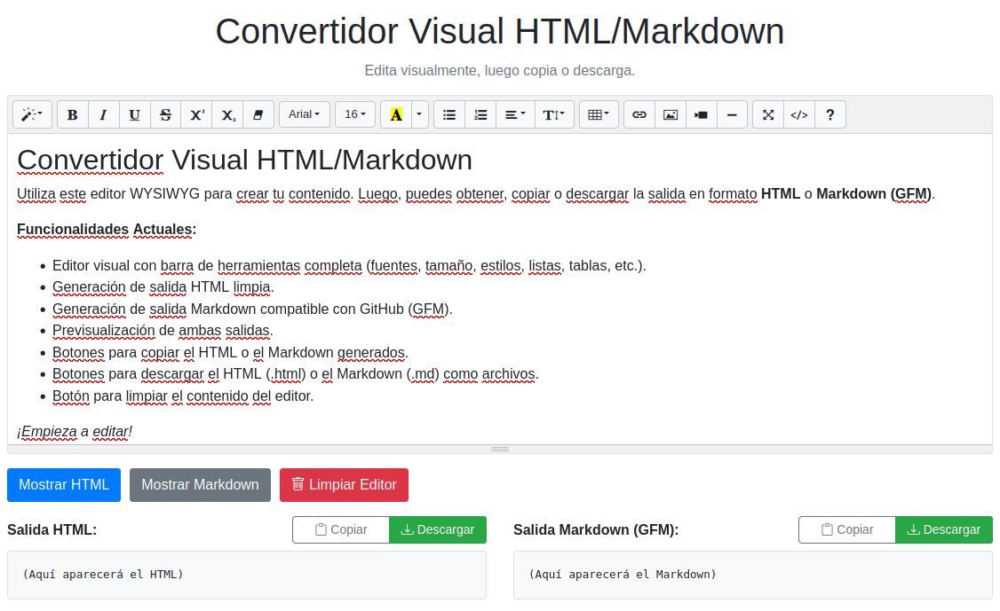

📄 Visual HTML/Markdown Editor ✨

[](https://opensource.org/licenses/MIT) [](https://soyunomas.github.io/Visual-HTML-Markdown-Editor/index.html)

Una aplicación web simple, del lado del cliente, para editar contenido visualmente (WYSIWYG) y generar código HTML limpio y Markdown (GFM). Permite copiar o descargar las salidas generadas. Construido con HTML5, Bootstrap 4, JavaScript (jQuery), Summernote y Turndown.

---

🚀 **Demo:** [**¡Pruébalo en vivo!**](https://soyunomas.github.io/Visual-HTML-Markdown-Editor/index.html)

---

## 📸 Captura de Pantalla



---

## ✨ Características

*   ✒️ Edición WYSIWYG intuitiva usando **Summernote** v0.8.18.
*   ⚙️ Generación de salida **HTML** limpia.
*   ⚙️ Generación de salida **Markdown** compatible con GitHub (GFM) usando **Turndown**.
*   👀 Paneles de previsualización para ambas salidas.
*   📋 Botón para **Copiar HTML** generado al portapapeles.
*   📋 Botón para **Copiar Markdown** generado al portapapeles.
*   💾 Botón para **Descargar HTML** como archivo `.html`.
*   💾 Botón para **Descargar Markdown** como archivo `.md`.
*   🗑️ Botón para **Limpiar** el contenido del editor.
*   📱 Diseño responsivo usando **Bootstrap 4**.
*   📄 Funciona como un único archivo `index.html` con dependencias externas (CDN).

## 🛠️ Cómo Usar

1.  Clona o descarga este repositorio.
2.  Abre el archivo `index.html` directamente en tu navegador web moderno.
3.  Edita el contenido visualmente usando la barra de herramientas del editor Summernote.
4.  Haz clic en "Mostrar HTML" o "Mostrar Markdown" para generar y ver las salidas en los paneles inferiores.
5.  Utiliza los botones de Copiar, Descargar o Limpiar según necesites.

## 💻 Tecnologías Utilizadas

*   🌐 HTML5 (Semántico)
*   🎨 CSS3 (Incrustado para estilos básicos)
*   🖌️ Bootstrap **4.6.2** (para estilos y maquetación responsiva)
*   ✨ JavaScript (ES6+ & **jQuery** 3.7.1)
*   📝 **Summernote** (v0.8.18 para BS4) (Editor WYSIWYG)
*   🔄 **Turndown** (Conversión de HTML a Markdown)
*   🔌 **Turndown GFM Plugin** (Soporte para tablas, etc., en Markdown)

## 📄 Licencia

Este proyecto está bajo la Licencia MIT.

```text
MIT License

Copyright (c) 2025 soyunomas

Permission is hereby granted, free of charge, to any person obtaining a copy
of this software and associated documentation files (the "Software"), to deal
in the Software without restriction, including without limitation the rights
to use, copy, modify, merge, publish, distribute, sublicense, and/or sell
copies of the Software, and to permit persons to whom the Software is
furnished to do so, subject to the following conditions:

The above copyright notice and this permission notice shall be included in all
copies or substantial portions of the Software.

THE SOFTWARE IS PROVIDED "AS IS", WITHOUT WARRANTY OF ANY KIND, EXPRESS OR
IMPLIED, INCLUDING BUT NOT LIMITED TO THE WARRANTIES OF MERCHANTABILITY,
FITNESS FOR A PARTICULAR PURPOSE AND NONINFRINGEMENT. IN NO EVENT SHALL THE
AUTHORS OR COPYRIGHT HOLDERS BE LIABLE FOR ANY CLAIM, DAMAGES OR OTHER
LIABILITY, WHETHER IN AN ACTION OF CONTRACT, TORT OR OTHERWISE, ARISING FROM,
OUT OF OR IN CONNECTION WITH THE SOFTWARE OR THE USE OR OTHER DEALINGS IN THE
SOFTWARE.
